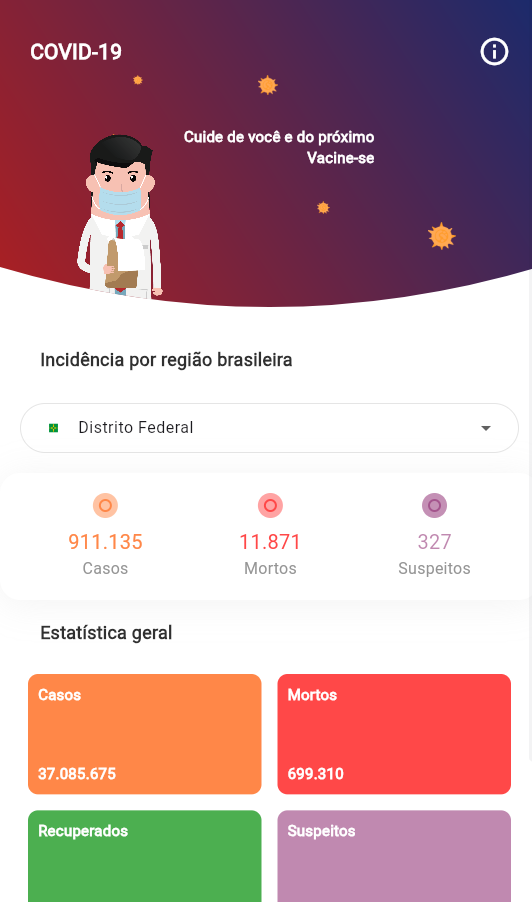

# COVID Tracker

An informative application about the incidence of COVID-19 disease in Brazilian states.

<p align="center">
    
</p>

## Author

* Marcos Bezerra Campos 
* **Email:** rvlt1.prog@gmail.com 

## Dependencies

- cupertino_icons: ^1.0.2
- flutter_svg: ^1.1.1+1
- http: ^0.13.4
- intl: any

[Flutter System Dependencies](https://docs.flutter.dev/get-started/install)

## Setting up 

```bash
$ git clone https://github.com/marcos-c1/covid-app covid-app 
$ cd covid-app 
$ flutter clean 
$ flutter pub get
$ flutter create . // if you want to run on web
$ flutter run -d chrome
```
